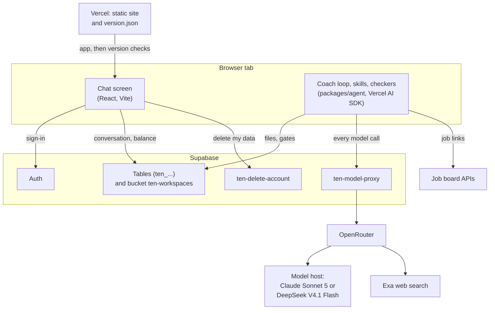
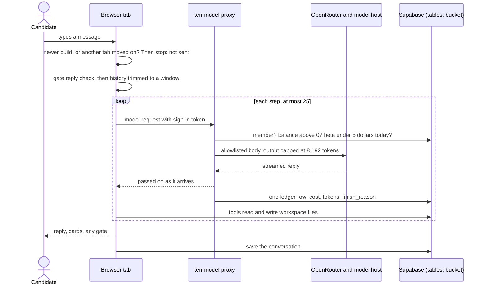
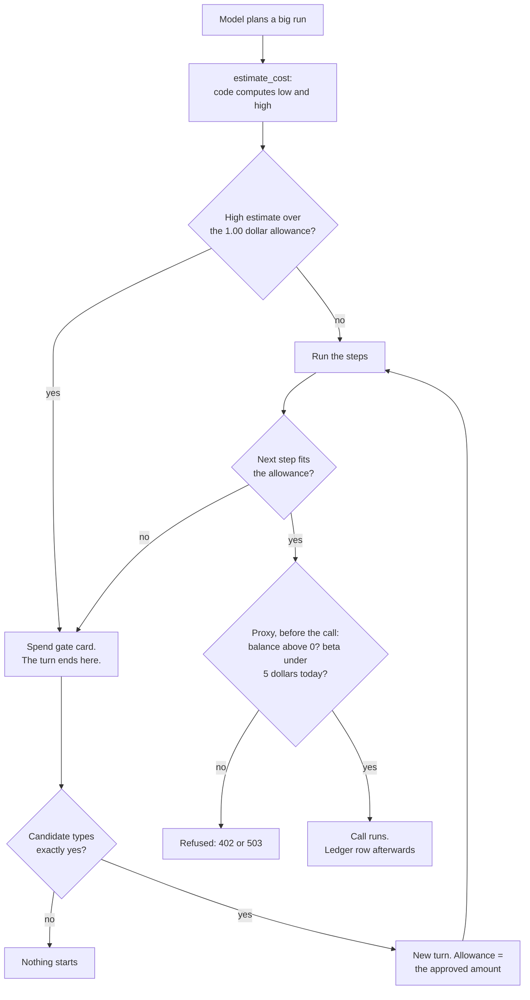
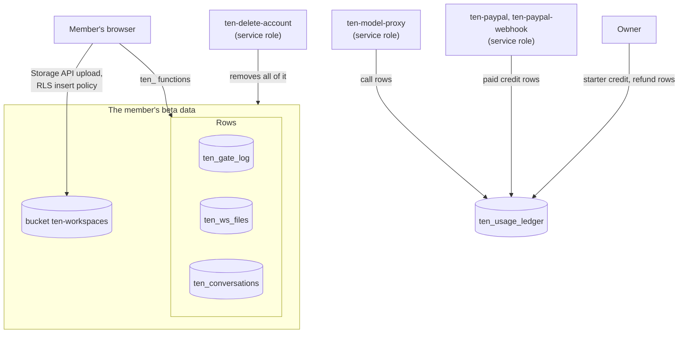
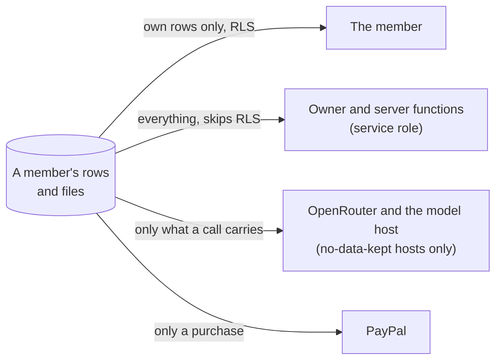
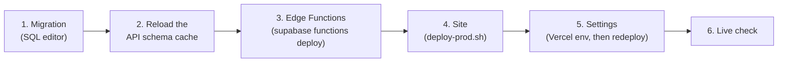

# Architecture — how Ten is put together

**Ten** is this project's job-search coach (the repo is
`10xjobs-careercoach`). It ships two ways:

- **As Claude skills in a folder.** You install the skills (see
  [`INSTALL.md`](../INSTALL.md)) and the coach works on plain files on
  your own machine. No server of ours is involved.
- **As a web app (private beta).** The same skills run inside a browser
  tab, and the files live in a cloud workspace. This half has the moving
  parts, so most of this page is about it.

This page is a map. Each part explains the idea and then links to the
contract that owns the detail. When this page and a contract disagree,
the contract wins; please fix this page. The web contract is
[`design-web-agent.md`](design-web-agent.md) ("C" below); the screens
are in [`design-web-ui.md`](design-web-ui.md). Everything answers to
[`PRINCIPLES.md`](../PRINCIPLES.md).

## Words used here

**The product**

- **Candidate:** the person searching for a job. On the web, a
  **member** is a signed-in candidate with a credit row; only members
  can use Ten.
- **Skill:** a folder of instructions for the model
  (`skills/<name>/SKILL.md`, plus references and checker scripts).
- **Workspace:** the candidate's files: profile, jobs list, résumés, plan.
- **Turn:** one candidate message and everything the coach does in reply.
  A turn has **steps**: one model call each, plus the tools it asks for.
- **Card:** a box in the chat (a verdict, a plan, a cost) that code builds
  from a file or a script's output. The model never writes one.

**Gates** (three different things share the word)

- **Spend gate:** the coach stops and asks for the candidate's typed
  `yes` before a run that costs money. The only gate in the web app.
- **Candidate-action gate:** the same typed-yes step before anything is
  sent or submitted as the candidate. It exists in the local skills; the
  web app has no send or submit tools at all.
- **Design gate:** the project's own step: a change is designed and
  approved before it is built ([`PROCESS.md`](PROCESS.md)).

**Money and servers**

- **Proxy:** our server function between the browser and the model
  provider. It holds the model key.
- **Ledger:** the one table that records money: credits in (starter and
  paid), calls and refunds out.
- **Allowance:** how much one turn may spend without asking: $1.00, or
  the amount of a spend gate the candidate just approved.
- **RLS (row-level security):** Postgres rules that decide which rows
  each signed-in user can see.
- **Service role:** a server-only Supabase key that skips RLS. Only our
  server functions and the owner use it.
- **Anon key:** the public Supabase key the site ships with. It grants
  nothing by itself; RLS does the guarding.

**How we work** (more in [`TEAM.md`](TEAM.md))

- **Slice:** one piece of work, sized for one builder.
- **Spike:** a small throwaway experiment that answers one question.
- **Fixture persona:** an invented candidate used in tests and demos.
- **Conduct harness:** runs a skill against a planted workspace and has a
  second model judge the result, several times (`tests/always-on/`).
- **Receipt:** the dated, real incident that earned a rule.

**Principles these docs cite** (full text in
[`PRINCIPLES.md`](../PRINCIPLES.md)): 5 spend like it's yours · 7 typed
yes before anything sent, submitted or paid · 8 honest numbers · 9 your
data is yours · 10 safe at the offer stage · 12 one of everything ·
16 every loop is bounded · 18 plain language.

## 1. The system map

- **The agent loop runs in the tab, not on a server.** `apps/web` builds
  it from `packages/agent` (`createCoach`, C § 1). The package has no
  browser-only or Node-only imports, so the same loop can later run on a
  server. A test fails if that rule breaks.
- **The skills are bundled into the site at build time,** read-only. The
  checker scripts they call run as JavaScript ports (`packages/checkers`)
  behind a fake `python3` command. A parity test keeps the ports matching
  the Python (C § 5).
- **Vercel only serves static files,** including `version.json`, which
  open tabs read to spot a newer build (C § 10). Supabase holds
  everything with state (C § 8).
- **Every model call goes through `ten-model-proxy`.** The browser holds
  only the user's sign-in token. The OpenRouter key is a Supabase function
  secret. Those secrets are project-wide, so both functions could read
  it; only the proxy uses it.
- **The model is a build setting,** `VITE_COACH_MODEL`. Unset means Claude
  Sonnet 5, the model the skills were measured on. DeepSeek is for cheap
  plumbing tests only (C § 13).
- **Search and job links:** web search is an OpenRouter plugin pinned to
  Exa (C § 14). Links on four boards (Greenhouse, Lever, Ashby,
  SmartRecruiters) are read from the board's public API; anything else,
  the candidate pastes (C § 4).

## 2. One coaching turn

- **Before sending:** if a newer build is live (C § 10) or another tab
  changed the conversation (C § 11.5), the message is not sent. A check
  that fails or is slow never blocks.
- **In the tab:** code matches any gate reply (C § 3), then trims older
  history to about 4,000 words (C § 7).
- **At the proxy:** checks run in order: sign-in, a 256 KB size cap,
  membership, balance, the daily limit. Then it builds a fresh request
  from an allowlist, streams the reply back, and meters a copy into a
  ledger row (C § 8, § 9.6).
- **Tools run in the tab** (C § 4). Cards are built by code from files
  and script output, never by the model (C § 6.2).
- **At the end,** the conversation is saved as one row (C § 11).

Three ways a turn can stop early:

- **Cut off:** the reply hit the output cap. The coach makes one
  continuation call, telling the model that nothing in the cut-off reply
  ran. If it can't continue, the candidate sees `cut_off` (C § 9).
- **Step cap:** 25 steps in one turn. The candidate sees `step_cap`, and
  the next turn is told where it stopped (C § 9.4).
- **Too large:** a long turn is trimmed as it grows: old tool output
  becomes a short stub (C § 12.1). If the proxy still refuses it for
  size, the candidate sees `too_large` (C § 12.2).

## 3. The money path

- **The estimate comes from code, not the model** (rule 8). It uses this
  chat's measured step costs, or dated constants on turn 1 (C § 4, § 14).
- **Only a typed, exact `yes` approves.** There is no approve button
  (rule 7; C § 3). If a run would pass its allowance mid-turn, the loop
  stops before that step and opens a "Continue this run" gate.
- **The proxy checks before each call:** a balance at or below zero gets
  402; at $5 of beta-wide spend today (UTC), every call gets 503 (C § 8).
- **The limits can be overshot by calls already running.** The checks
  happen before a call, and the cost is known only after it. Calls that
  start together all pass the check, so a balance or the $5 day can go
  over by whatever those calls cost (C § 8, "the honest bound"). The
  output cap and the size cap keep each call small, but that is an
  expected size, not a bound on the charge (next point).
- **The per-call ceiling is not a cap.** It is what the caps allow at
  today's listed prices, per model: about $0.27 for Claude, $0.04 for
  DeepSeek (C § 13.1). The proxy uses it in two ways. A reported cost
  from $0 up to 10 times the ceiling is recorded as reported, even above
  the ceiling. The ceiling itself is charged when the cost is missing,
  unreadable, negative or over 10 times the ceiling, or when the meter
  ran out of time.
- **The balance is derived, never stored:** credits minus calls, from the
  ledger (rule 12).
- **Buying credit adds to it** (C § 17). A member pays in PayPal's own
  window; `ten-paypal` credits what arrived after PayPal's fee, one row
  per payment, and `ten-paypal-webhook` is the backup when the browser
  never hears back. Only orders Ten created and signed are credited
  (C § 17.10). Buying never approves or raises a spend (rule 7).

## 4. The data model

Who writes what:

| What | Holds | Written by |
|---|---|---|
| `ten_usage_ledger` | credits, refunds and calls: tokens, dollars, model, `finish_reason`; for a payment, gross and fee | the proxy (calls); `ten-paypal` and `ten-paypal-webhook` (paid credits); the owner (starter credits, refunds) |
| `ten_gate_log` | each spend gate and its status | the member's browser, via `ten_gate_open`, `ten_gate_decide`, `ten_gate_expire_other_chats` |
| `ten_ws_files` | workspace text files (`.md .txt .json .html`) | the member, via `ten_ws_write`, which refuses a stale version |
| `ten_conversations` | one saved conversation per user | the member, via `ten_conversation_save`, same stale-version rule |
| bucket `ten-workspaces` | uploaded `.pdf` and `.docx`, under `users/<uid>/ws/` | the member, create only |

Who can read what:

- **The member** reads only their own rows (RLS, with membership checked).
  The ledger is the exception: any signed-in user can read their own
  ledger rows, because membership itself lives there.
- **The owner and the server functions** use the service role, which
  skips RLS. The proxy reads balances and today's spend.
- **OpenRouter and the model host** see what a call carries: the turn's
  messages, the text of any file the coach reads, and tool results. The
  proxy forces the filter that sends calls only to hosts that keep no
  data and don't train on it. The candidate-facing list of hosts is the
  [privacy page](../apps/web/public/privacy.html) (C § 13.6).
- **PayPal** sees only a purchase: the amount, an internal account id
  (`ten:<uid>`) and Ten's signed invoice id. The payer's own PayPal
  details stay with PayPal; Ten keeps the amount, fee and PayPal's
  transaction id (C § 17.3, § 17.6).
- **The gate log is a record, not proof;** the candidate's browser writes
  it. Spending is stopped by the proxy (C § 3).
- **Delete** removes the member's files, gates and conversation. It
  keeps the shared sign-in and every ledger row (credits, refunds,
  calls), which hold amounts only, no content, so paid credit is never
  lost (C § 17.4).
- **The bucket has restrictive "pin" policies,** so a policy added later
  by anyone cannot open it to other users (C § 8).
- **Schema:** [`supabase/migrations/`](../supabase/migrations/), in date
  order. An applied migration is never edited; a change is a new file.

## 5. Deploying

**Only the owner runs production steps:** migrations and teardown, Edge
Function deploys and secrets, site deploys, Vercel and Auth settings,
credit rows. Agents prepare the exact commands and checks for the owner;
they never run them and never hold secrets. During the 2026-09-23 to
2026-09-25 beta setup, the lead agent ran several of these steps, each on
the owner's explicit approval; that exception is closed (C § 15).

**Why this order:** each layer must exist before the layer that uses it.
A proxy that writes a new column before the column exists would fail
every ledger insert, so calls would go unbilled (C § 9.6). The delete
function must cover new data before the site writes any (C § 11.8). A
Vercel setting is baked in at build time, so it needs a fresh site
deploy. Each change's contract states its own order, and it can differ:
§ 13's contract requires site first, then proxy, then the setting,
because the new proxy refuses requests the old site sends (C § 13.2).
§ 17 (buying credit): the older app's patch, the migration,
`ten-delete-account`, `ten-paypal`, `ten-paypal-webhook` and its id, then
the site (C § 17.7).

**The site deploy is a script,**
[`apps/web/scripts/deploy-prod.sh`](../apps/web/scripts/deploy-prod.sh).
It builds on the machine and uploads the build. It refuses to upload if:

- any file contains a home-directory path (earned by the first
  production deploy);
- the skill text is missing;
- `version.json` is missing or unreadable, or its build id is in no
  JavaScript file (C § 10.1).

Function deploy steps and secrets:
[`supabase/functions/README.md`](../supabase/functions/README.md). Site
settings: [`apps/web/README.md`](../apps/web/README.md).

## Where to change what

| To change… | Edit | Contract |
|---|---|---|
| What the coach says or does | `skills/<name>/SKILL.md`, `references/patterns.md` | [`skill-shape.md`](skill-shape.md), [`PROCESS.md`](PROCESS.md) |
| A checker's rules | `skills/<name>/scripts/*.py` **and** its port in `packages/checkers` (parity test) | C § 5 |
| The agent loop, tools, gate, cost estimate | `packages/agent/src/` (`coach.ts`, `tools/index.ts`, `estimate-cost.ts`) | C § 1, § 3, § 4, § 9, § 12 |
| The proxy's rules, models, ceilings | `supabase/functions/ten-model-proxy/core.ts`, `handler.ts` | C § 8, § 13, § 14 |
| Tables and access rules | a **new** file in `supabase/migrations/`, plus the teardown and `tests/sql/` | C § 2, § 8 |
| Screens and cards | `apps/web/src/components/`, `apps/web/src/real/` | [`design-web-ui.md`](design-web-ui.md) |
| Tests | your package's own tests; `tests/` holds the skill tests and the independent tester's suites | [`CONTRIBUTING.md`](../CONTRIBUTING.md) |
| Deploy | `apps/web/scripts/deploy-prod.sh`, `supabase/functions/README.md` | C § 10.1, § 11.8, § 13.2 |

## Invariants you must not break

- **Money.** No model key ever reaches the browser. Every call is
  metered into one ledger row; if that insert fails twice, the row is
  lost and the proxy logs an alert (`handler.ts`). The balance is derived
  from the ledger, never stored. The proxy's checks (balance, $5/day,
  output cap, size cap, model allowlist) are the real spending stops, and
  calls already running can overshoot them by their own cost.
  Source: [C § 8](design-web-agent.md#8-model-proxy-balance-and-the-production-project), rule 5.
- **Privacy: no data kept.** The proxy forces the provider filter
  (`data_collection: "deny"`, `zdr: true`), so only hosts that keep no
  data serve a call. Logs never hold conversation content (C § 11.7).
  Delete removes all career data. No candidate data ever enters this
  repo. Source: [rule 9](../PRINCIPLES.md), C § 8, and the PII guards in
  [`tests/test_invariants.py`](../tests/test_invariants.py) and
  [`tests/test_docs_guard.py`](../tests/test_docs_guard.py).
- **Honesty (rule 8).** Cards, costs and the model name are built by code
  from files and measurements, never from the model's prose. Error
  messages say what happened and what the candidate can do, never a
  promise. Source: [C § 6.2](design-web-agent.md#62-where-every-card-comes-from),
  C § 13.3, [rule 8](../PRINCIPLES.md).
- **Typed yes (rule 7).** Only the candidate's typed, exact `yes`
  approves a spend. No button, no model output, no pasted text can do it.
  Source: [C § 3](design-web-agent.md#3-gate-protocol),
  [`gate-grammar.md`](../skills/coach/references/gate-grammar.md).
- **Guardrails the agent can't rewrite.** The system prompt comes from the
  bundled skills, and the agent cannot write `CLAUDE.md` or `skills/`, so
  a job post can't talk it into changing its own rules
  ([C § 7](design-web-agent.md#7-staged-loading-and-the-per-turn-window)).

*Checked against the code at commit `650cfc1` (2026-09-25). Not verified
here: that the job-board APIs answer browser requests for single
postings (C § 4 marks it UNVERIFIED), and anything about the live
Vercel or Supabase settings.*
