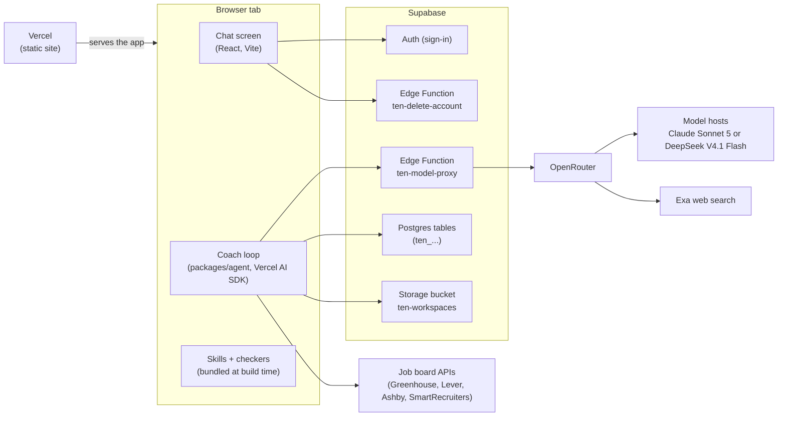
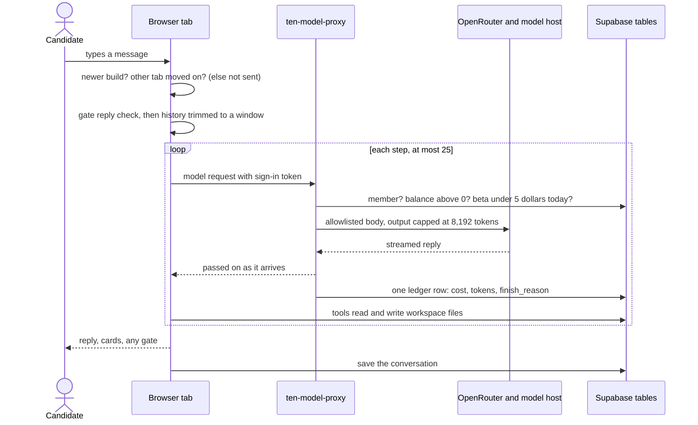
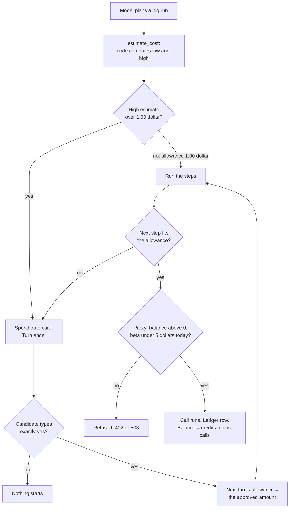
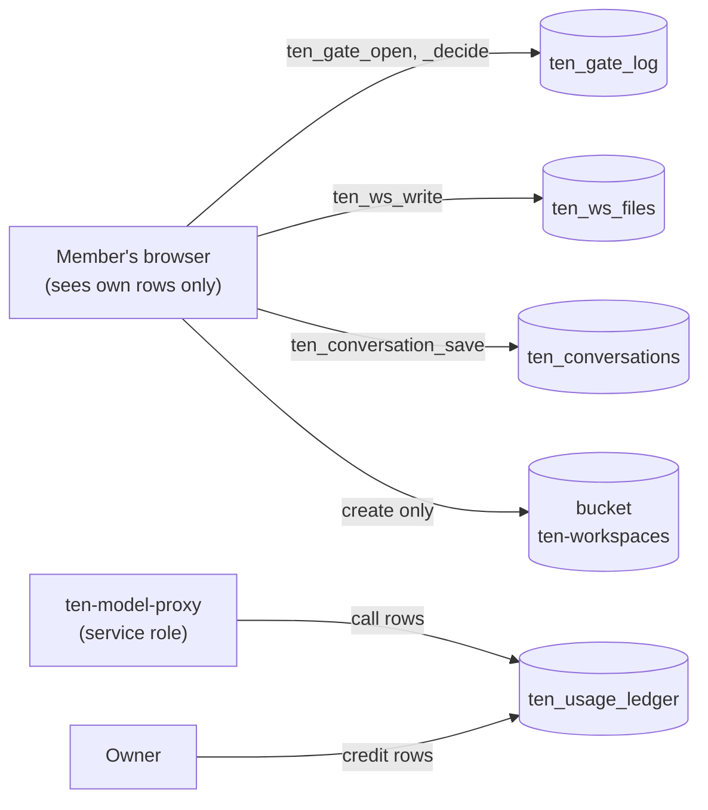
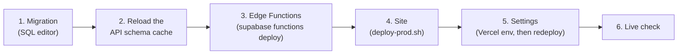

# Architecture — how Ten is put together

Ten is a job-search coach. It ships two ways:

- **As Claude skills in a folder.** You install the skills (see
  [`INSTALL.md`](../INSTALL.md)) and the coach works on plain files on
  your own machine. No server of ours is involved.
- **As a web app (private beta).** The same skills run inside a browser
  tab, and the files live in a cloud workspace. This half has the moving
  parts, so most of this page is about it.

This page is a map. Each part explains the idea and then links to the
contract that owns the detail. When this page and a contract disagree,
the contract wins; please fix this page. The web contract is
[`design-web-agent.md`](design-web-agent.md) ("C" below); the screens
are in [`design-web-ui.md`](design-web-ui.md). Everything answers to
[`PRINCIPLES.md`](../PRINCIPLES.md).

**Words used below:**

- **Skill:** a folder of instructions for the model (`skills/<name>/SKILL.md`
  plus references and checker scripts).
- **Workspace:** the candidate's files (profile, jobs list, résumés, plan).
- **Turn:** one message from the candidate and everything the coach does
  in reply. A turn has **steps**: one model call each, plus the tools
  that call asks for.
- **Proxy:** our server function that stands between the browser and the
  model provider. It holds the only model key.
- **Ledger:** the one table that records money: credits in, calls out.
- **Gate:** the moment the coach stops and asks for the candidate's typed
  `yes` before spending (PRINCIPLES rule 7).
- **RLS (row-level security):** Postgres rules that decide which rows each
  signed-in user can see.
- **Member:** a signed-in user who has a credit row. Only members can use Ten.

## 1. The system map

- **The agent loop runs in the tab, not on a server.** `apps/web` builds
  the loop from `packages/agent` (`createCoach`, C § 1). The package has
  no browser-only or Node-only imports, so the same loop can later run on
  a server. A test fails if that rule breaks.
- **The skills are bundled into the site at build time,** read-only. The
  checker scripts they call run as JavaScript ports (`packages/checkers`)
  behind a fake `python3` command. A parity test keeps the ports matching
  the Python (C § 5).
- **Vercel only serves static files.** Supabase holds everything with
  state (C § 8).
- **Every model call goes through `ten-model-proxy`.** The browser holds
  only the user's sign-in token; the proxy holds the OpenRouter key.
- **The model is a build setting,** `VITE_COACH_MODEL`. Unset means Claude
  Sonnet 5, the model the skills were measured on. DeepSeek is for cheap
  plumbing tests only (C § 13).
- **Search and job links:** web search is an OpenRouter plugin pinned to
  Exa (C § 14). Job links on four boards are read from the board's public
  API; anything else, the candidate pastes (C § 4).

## 2. One coaching turn

- **Before sending:** if a newer build is live (C § 10) or another tab
  changed the conversation (C § 11.5), the message is not sent. A check
  that fails or is slow never blocks.
- **In the tab:** code matches any gate reply (C § 3), then trims older
  history to about 4,000 words (C § 7).
- **At the proxy:** checks run in order: sign-in, a 256 KB size cap,
  membership, balance, the daily limit. Then it builds a fresh request
  from an allowlist, streams the reply back, and meters a copy into one
  ledger row per call (C § 8, § 9.6).
- **Tools run in the tab** (C § 4). Cards are built by code from files
  and script output, never by the model (C § 6.2).
- **At the end,** the conversation is saved as one row (C § 11).

Three ways a turn can stop early:

- **Cut off:** the reply hit the output cap. The coach makes one
  continuation call, telling the model that nothing in the cut-off reply
  ran. If it can't continue, the candidate sees `cut_off` (C § 9).
- **Step cap:** 25 steps in one turn. The candidate sees `step_cap`, and
  the next turn is told where it stopped (C § 9.4).
- **Too large:** a long turn is trimmed as it grows: old tool output
  becomes a short stub (C § 12.1). If the proxy still refuses it for
  size, the candidate sees `too_large` (C § 12.2).

## 3. The money path

- **The estimate comes from code, not the model** (rule 8). It uses this
  chat's measured step costs, or dated constants on turn 1 (C § 4, § 14).
- **Only a typed, exact `yes` approves.** There is no approve button
  (rule 7; C § 3). If a run would pass its allowance mid-turn, the loop
  stops before that step and opens a "Continue this run" gate.
- **The proxy enforces the hard limits.** A balance at or below zero gets
  402. At $5 of beta-wide spend today (UTC), every call gets 503 (C § 8).
- **Each call's cost is bounded** by the output cap and the size cap. The
  **per-call ceiling** is that bound, priced for each model: about $0.27
  for Claude and $0.04 for DeepSeek (C § 13.1). The proxy never refuses
  a call because of it. It charges the ceiling when a call's real cost
  is missing, so a lost cost never goes uncharged.
- **The balance is derived, never stored:** credits minus calls, from the
  ledger (rule 12).

## 4. The data model

| What | Holds | Who can write |
|---|---|---|
| `ten_usage_ledger` | credits and calls: tokens, dollars, model, `finish_reason` | the proxy (calls); the owner (credits). Users only read their own rows. |
| `ten_gate_log` | each spend gate and its status | the member's browser, through `ten_gate_open` / `ten_gate_decide` / `ten_gate_expire_other_chats` |
| `ten_ws_files` | workspace text files (`.md .txt .json .html`) | the member, through `ten_ws_write`, which refuses a stale version |
| `ten_conversations` | one saved conversation per user | the member, through `ten_conversation_save`, same stale-version rule |
| bucket `ten-workspaces` | uploaded `.pdf` and `.docx`, under `users/<uid>/ws/` | the member, create only |

- **RLS is on for every table.** Members read only their own rows. Writes
  go through functions that act only on the caller's rows (C § 2, § 11.2).
- **The gate log is a record, not proof;** the candidate's browser writes
  it. Spending is stopped by the proxy (C § 3).
- **Delete** removes the user's files, gates, conversation and credit
  rows. It keeps the shared sign-in and the call rows, which hold amounts
  only, no content (C § 8).
- **The bucket has restrictive "pin" policies,** so a policy added later
  by anyone cannot open it to other users (C § 8).
- **Schema:** [`supabase/migrations/`](../supabase/migrations/), in
  date order. An applied migration is never edited; a change is a new
  file.

## 5. Deploying

**Only the owner deploys.** No agent runs any of these steps.

**Why this order:** each layer must exist before the layer that uses it.
A proxy that writes a new column before the column exists would fail
every ledger insert, so calls would go unbilled (C § 9.6). The delete
function must cover new data before the site writes any (C § 11.8). A
Vercel setting is baked in at build time, so it needs a fresh site
deploy. Each change's contract states its own order, and it can differ.
For example, § 13 shipped site first, then proxy, so no live build was
ever refused (C § 13.2).

**The site deploy is a script,**
[`apps/web/scripts/deploy-prod.sh`](../apps/web/scripts/deploy-prod.sh).
It builds on the machine and uploads the build. It refuses to upload if:

- any file contains a home-directory path (earned by the first
  production deploy);
- the skill text is missing;
- `version.json` is missing or unreadable, or its build id is in no
  JavaScript file (C § 10.1).

Function deploy steps and secrets:
[`supabase/functions/README.md`](../supabase/functions/README.md). Site
settings: [`apps/web/README.md`](../apps/web/README.md).

## Where to change what

| To change… | Edit | Contract |
|---|---|---|
| What the coach says or does | `skills/<name>/SKILL.md`, `references/patterns.md` | [`skill-shape.md`](skill-shape.md), [`PROCESS.md`](PROCESS.md) |
| A checker's rules | `skills/<name>/scripts/*.py` **and** its port in `packages/checkers` (parity test) | C § 5 |
| The agent loop, tools, gate, cost estimate | `packages/agent/src/` (`coach.ts`, `tools/index.ts`, `estimate-cost.ts`) | C § 1, § 3, § 4, § 9, § 12 |
| The proxy's rules, models, ceilings | `supabase/functions/ten-model-proxy/core.ts`, `handler.ts` | C § 8, § 13, § 14 |
| Tables and access rules | a **new** file in `supabase/migrations/`, plus the teardown and `tests/sql/` | C § 2, § 8 |
| Screens and cards | `apps/web/src/components/`, `apps/web/src/real/` | [`design-web-ui.md`](design-web-ui.md) |
| Tests | your package's own tests; `tests/` holds the skill tests and the independent tester's suites | [`TEAM.md`](TEAM.md) |
| Deploy | `apps/web/scripts/deploy-prod.sh`, `supabase/functions/README.md` | C § 10.1, § 11.8, § 13.2 |

## Invariants you must not break

- **Money.** No model key ever reaches the browser. Every call is metered
  with exactly one ledger row. The balance is derived from the ledger,
  never stored. The proxy's limits (balance, $5/day, output cap, size
  cap, model allowlist) are the real spending stops.
  Source: [C § 8](design-web-agent.md#8-model-proxy-balance-and-the-production-project), rule 5.
- **Privacy: no data kept.** The proxy forces the provider filter
  (`data_collection: "deny"`, `zdr: true`), so only hosts that keep no
  data serve a call. Logs never hold conversation content (C § 11.7).
  Delete removes all career data. No candidate data ever enters this
  repo. Source: [rule 9](../PRINCIPLES.md), C § 8, and the PII guard in
  [`tests/test_invariants.py`](../tests/test_invariants.py).
- **Honesty (rule 8).** Cards, costs and the model name are built by code
  from files and measurements, never from the model's prose. Error
  messages say what happened and what the candidate can do, never a
  promise. Source: [C § 6.2](design-web-agent.md#62-where-every-card-comes-from),
  C § 13.3, [rule 8](../PRINCIPLES.md).
- **Typed yes (rule 7).** Only the candidate's typed, exact `yes`
  approves a spend. No button, no model output, no pasted text can do it.
  Source: [C § 3](design-web-agent.md#3-gate-protocol),
  [`gate-grammar.md`](../skills/coach/references/gate-grammar.md).
- **Guardrails the agent can't rewrite.** The system prompt comes from the
  bundled skills, and the agent cannot write `CLAUDE.md` or `skills/`, so
  a job post can't talk it into changing its own rules
  ([C § 7](design-web-agent.md#7-staged-loading-and-the-per-turn-window)).

*Checked against the code at commit `650cfc1` (2026-09-25). Not verified
here: that the job-board APIs answer browser requests for single
postings (C § 4 marks it UNVERIFIED), and anything about the live
Vercel or Supabase settings.*
