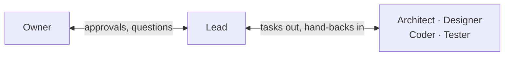
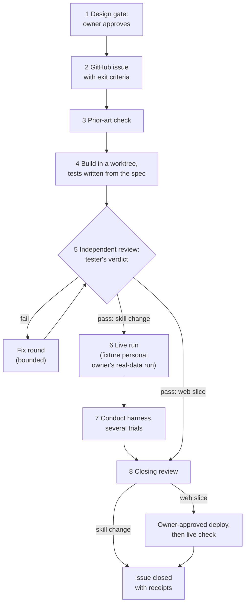
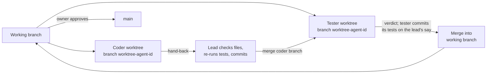

# The team — how work gets done here

Most of this repo was written by a small team of AI agents run by one
human owner. This page explains who does what, the loop every change
goes through, and where you fit in as a contributor. You can join with
your own agents or with none; the rules are the same.

The four agent roles have files in [`agents/`](../agents/); the owner
and the lead have none (their jobs are described here and in
[`agents/README.md`](../agents/README.md)). The loop is
[`PROCESS.md`](PROCESS.md). The plan that set up the team is
[`plan-portable-skills-and-web-agent.md` § The team](plan-portable-skills-and-web-agent.md#the-team).

**Two terms:**

- **Hand-back:** the message an agent returns when its task is done:
  what it changed, the commands it ran with their real output, and what
  is still open.
- **Worktree:** a second checkout of the repo in its own folder, on its
  own branch (`git worktree`). Each building agent gets one, so parallel
  work never collides.

## Roles

| Role | Does | Never does | Hands back |
|---|---|---|---|
| **Owner** (a human; no role file) | Decides what gets built. Approves contracts, designs, spending and every production change. Holds every key. Applies migrations. Runs Ten on real data, in their own account. | Gives an agent a secret, a production write, or real user data. | Decisions, recorded in the issue or the contract with a date ("owner, 2026-09-24"). |
| **Lead** (the main agent session; no role file) | Holds the issue and runs the loop. Starts every other agent. Checks each hand-back by reading the files and re-running the commands. Commits and merges. Brings every approval to the owner. | Approves on the owner's behalf. Believes a hand-back it hasn't checked. There is no other coordinator. | To the owner: a checked summary and the questions that need a decision. |
| **Architect** ([`architect.md`](../agents/architect.md)) | Contracts, design gates, spike notes, closing reviews against [`PRINCIPLES.md`](../PRINCIPLES.md). Docs only. | Writes feature code. Reviews its own contract. | Files written, decisions with reasons, open questions, anything UNVERIFIED. |
| **Designer** ([`designer.md`](../agents/designer.md)) | Screens, cards, fixture conversations, the gate and balance, the phone layout. Exact values, rendered and looked at. | Wires live data. Uses real candidate data. | Files, the token table, screenshot paths (checked to exist), notes for the coder. |
| **Coder** ([`coder.md`](../agents/coder.md)) | Builds one slice against an agreed contract, with unit tests, in its own worktree. | Grades its own work. Commits (the lead commits coder work after checking it). Edits outside its slice without saying so. Hardcodes a key. | Files changed, commands run with real output, what is not done, blockers. |
| **Tester** ([`tester.md`](../agents/tester.md)) | Writes tests from the spec, not from the code. Runs them. Re-checks every fix itself. Commits its own tests when the lead says to. | Fixes product code. Takes the fixer's word. | PASS, FAIL or BLOCKED per exit criterion, with the command and its output. Findings by severity. |

**Who talks to whom.** Agents never hand work to each other directly.
Everything goes through the lead, and only the owner approves.

## The loop

The steps are [`PROCESS.md`](PROCESS.md)'s, numbered the same. A skill
change goes down the left path. A web slice (app, proxy, database) takes
the right path: its live check happens after an owner-approved deploy.

- **The design gate comes first.** Goal, assumptions, tradeoffs and a
  test plan are written and approved before any code. Behavior changes
  land as a numbered amendment to the contract, such as
  [C § 9](design-web-agent.md#9-cut-off-replies-amendment-2026-09-24).
- **Build and tests run in parallel,** and neither sees the other's
  work until the verdict. That is what makes the tests independent.
- **Fix rounds are bounded** (rule 16: 2 to 3 passes). Most slices
  closed in two ("round 2/2" in the log). The checker port took three,
  and the § 10–12 release needed a third fix after its second round
  (`df6a5cb`).
  If a round doesn't move, change the approach or take the choice to
  the owner.
- **Live runs** by contributors use a fixture persona in a fresh
  account or workspace. Closing a skill change also needs the owner's
  real-data run, or a waiver recorded in the issue (PROCESS step 6).

## How work moves between branches

Real example: the switchable-model build (C § 13). The coder's commit
`4078319` was merged into the tester's branch (`70c72b9`). The tester's
acceptance commit `62b0e58`, made on the lead's instruction, then went
back into the working branch (`650cfc1`). Agent worktrees live under `.claude/worktrees/`, which git
ignores.

## The tools

- **`python3 tests/run.py`**: one command for almost every suite: the
  skill tests, the repo rules and doc guards, the JavaScript and Deno
  suites, and the SQL harness. It does **not** run `apps/web`'s own
  `npm test` or the browser end-to-end suite in `tests/e2e-real/`; run
  those separately ([`CONTRIBUTING.md`](../CONTRIBUTING.md)). A missing
  tool makes a suite say `SKIPPED` out loud, never pass in silence.
- **[`scripts/check-handback-paths.mjs`](../scripts/check-handback-paths.mjs)**:
  reads a hand-back and checks that every file path it names exists.
  Exit 1 if one is missing. It turns "verify the file, not the
  narration" into one command.
- **[`scripts/design-sample.mjs`](../scripts/design-sample.mjs)**: prints
  a seeded sample of fonts, pairings and reference screens from
  [`design/library/`](../design/library/README.md), so each design task
  starts somewhere new instead of from habit.
- **[`scripts/capture.mjs`](../scripts/capture.mjs)**: screenshots a URL
  or a local HTML file at chosen widths (for example 375 and 1440). The
  output folder is required, so screenshots never land in the repo by
  accident. A local file never reaches the network.
- **[`tests/always-on/`](../tests/always-on/README.md)**: the conduct
  harness. It runs a skill against a planted workspace and has a second
  model judge the result. It spends money, so state the size first and
  get the owner's approval.

## Four short stories

Numbers only; no personal data. Each one changed a rule.

1. **The cut-off found in the ledger.** Three "evaluate 4 jobs" runs in a
   row ended on replies of exactly 4,096 output tokens: the cap. Across
   about 140 calls, every reply that ended on its own used at most 3,038.
   Nothing was saved, and about $1.37 was spent for nothing. The fix
   detects a cut-off, continues once, raises the cap to 8,192, and records
   why each call ended, so the next one shows up in the data without
   anyone reading a chat. ([C § 9](design-web-agent.md#9-cut-off-replies-amendment-2026-09-24);
   commits `0d8588a`, `6d80ff7`.)
2. **The tester corrected the contract.** The first draft of § 9 said a
   finished tool call in a cut-off step still ran. The tester's suite,
   written from the spec and run on the real installed packages, showed
   that the AI SDK runs no tool at all on a cut-off step. Worse, the
   unrun call stayed in the history with no result, so every later turn
   in that chat would fail. The contract was corrected, and the fix now
   treats every call in that step as not run. (C § 9, "Why it was
   silent"; commits `c9ec8bb`, `7c1b1be`, `610240c`.)
3. **A home path in the first bundle.** The first production deploy
   bundled Python cache files, and those embed the absolute home path of
   the machine that built them. It was caught after that deploy, and the
   site was redeployed and rescanned clean. Now the build leaves those
   files out, and
   `deploy-prod.sh` refuses any bundle that contains a home path. (Commit
   `f3bb90d`.)
4. **A stale tab ran old code.** The § 9 fix went live at 11:57. At
   14:00, a tab opened earlier ran a turn on the old code: no
   continuation, and none of the new skill hint. It saved nothing and
   cost about $0.81. Now every build carries an id, and a tab that sees
   a newer id refuses to send until it reloads.
   ([C § 10](design-web-agent.md#10-telling-an-open-tab-a-newer-version-is-live-amendment-2026-09-24);
   commits `2d87002`, `32057ce`.)

## Where a human contributor fits in

- **Run the agents yourself,** or do their jobs by hand. To load the
  role files into Claude Code, see [`agents/README.md`](../agents/README.md).
  Whoever runs them is the lead: you check every hand-back before you
  believe it.
- **Review agent pull requests** like any other. Read the diff against
  the contract section it names. Check that the tests came from the spec,
  and re-run them. Grep for keys and home paths.
- **Never hand an agent:**
  - **secrets:** API keys, the Supabase service-role key, any `.env` file;
  - **production writes:** migrations, deploys, setting secrets, credit
    rows, anything on the live project;
  - **real user data:** a real candidate workspace, production rows,
    chat transcripts.

  Agents work on fixtures, fresh temp workspaces and stubbed services.
  Spending real money (a harness batch, a live run) needs the owner's
  approval first.

Setup and pull request rules: [`CONTRIBUTING.md`](../CONTRIBUTING.md).
The system itself: [`ARCHITECTURE.md`](ARCHITECTURE.md).
